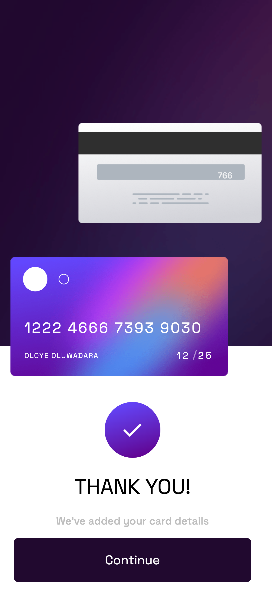

# Frontend Mentor - Interactive card details form solution

This is a solution to the [Interactive card details form challenge on Frontend Mentor](https://www.frontendmentor.io/challenges/interactive-card-details-form-XpS8cKZDWw). Frontend Mentor challenges help you improve your coding skills by building realistic projects. 

## Table of contents

- [Overview](#overview)
  - [The challenge](#the-challenge)
  - [Screenshot](#screenshot)
  - [Links](#links)
- [My process](#my-process)
  - [Built with](#built-with)
  - [What I learned](#what-i-learned)
  - [Continued development](#continued-development)
  - [Useful resources](#useful-resources)
- [Author](#author)
- [Acknowledgments](#acknowledgments)

## Overview

The interactive card project is basically about creating a simple page where a user can input their card details and save their card details. It is purely a frontend implementation for now and the data is not being stored anywhere. I worked on this to test my ReactJS skills as I have been learning it for a bit now. It was a good exercise which taught me a lot about React JS, indirectly passing props and so on.

### The challenge

Users should be able to:

- Fill in the form and see the card details update in real-time
- Receive error messages when the form is submitted if:
  - Any input field is empty
  - The card number, expiry date, or CVC fields are in the wrong format
- View the optimal layout depending on their device's screen size
- See hover, active, and focus states for interactive elements on the page

### Screenshot

### Links

- Solution URL: [Github](https://github.com/OluwadaraDaily/interactive-card)
- Live Site URL: [Interactive Cards](https://carrds.netlify.app)

## My process

I built it using React, as stated above. I started with the mobile view because that is standard practice these days as there are more mobile users of websites than laptop/desktop users.

### Built with

- Semantic HTML5 markup
- CSS custom properties
- Flexbox
- Mobile-first workflow
- [React](https://reactjs.org/) - JS library

### What I learned

- I struggled a lot with passing props from child to parent in React as it is not available; coming from a VueJS background, it was normal to pass props in either direction. 
- I also learned about routing proper using React Router v6

### Continued development

I plan to still work on:

- Testing using Cypress or any other frontend testing suites
- Add a CI/CD pipeline

### Useful resources

- [How to Pass Data from Child to Parent in React](https://blog.devgenius.io/how-to-pass-data-from-child-to-parent-in-react-33ed99a90f43) - This helped me to understand how to pass props from child to parent in react indirectly.

## Author

- Website - [Oluwadara Oloye](https://github.com/OluwadaraDaily)
- Frontend Mentor - [@OluwadaraDaily](https://www.frontendmentor.io/profile/OluwadaraDaily)
- Twitter - [@OluwadaraDaily](https://www.twitter.com/OluwadaraDaily)

## Acknowledgments

N/A
